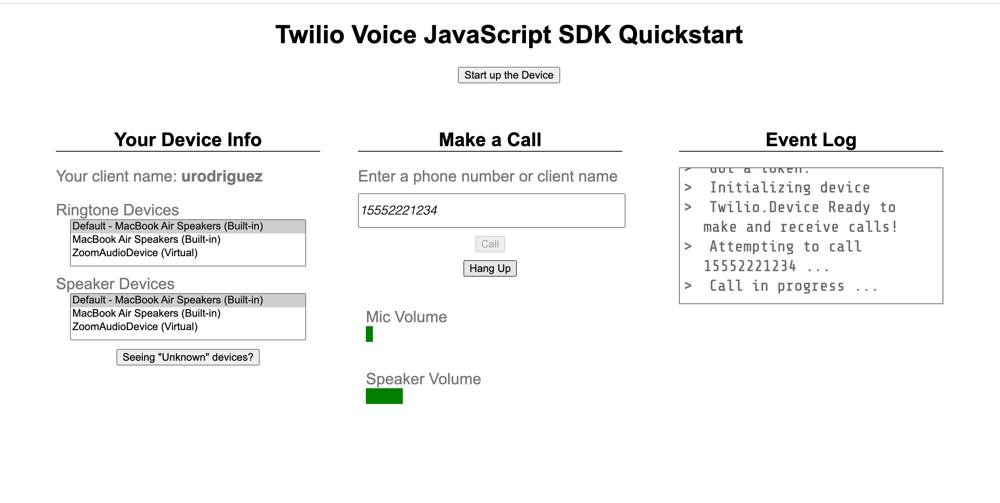
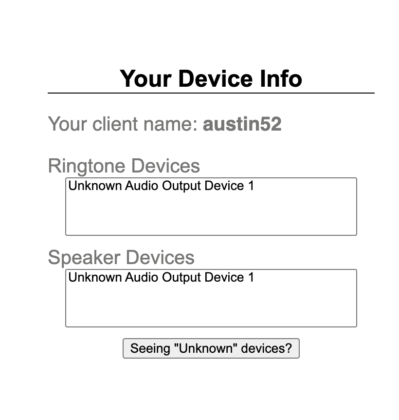

<a href="https://www.twilio.com">
  
</a>

# Twilio Voice JavaScript SDK Quickstart for Python


> This template is part of Twilio CodeExchange. If you encounter any issues with this code, please open an issue at [github.com/twilio-labs/code-exchange/issues](https://github.com/twilio-labs/code-exchange/issues).

## About

This application should give you a ready-made starting point for writing your own voice apps with the Twilio Voice JavaScript SDK (formerly known as Twilio Client).

This application uses the lightweight [Flask Framework](http://flask.pocoo.org/). Once you set up the application, you will be able to make and receive calls from your browser. You will also be able to switch between audio input/output devices, and see dynamic volume levels on the call.



Implementations in other languages:

| .NET | Java | Node | PHP | Ruby |
| :--- | :--- | :----- | :-- | :--- |
| [In progress] | [Done](https://github.com/TwilioDevEd/voice-javascript-sdk-quickstart-java)  | [Done](https://github.com/TwilioDevEd/voice-javascript-sdk-quickstart-node)  | [Done](https://github.com/TwilioDevEd/voice-javascript-sdk-quickstart-php) | [Done](https://github.com/TwilioDevEd/voice-javascript-sdk-quickstart-ruby)  |

## Set Up

### Requirements

- [Python](https://www.python.org/) **3.6**, **3.7**, **3.8**, or **3.9** version.
- [ngrok](https://ngrok.com/download)

### Twilio Account Settings

Before we begin, we need to collect all the config values we need to run the application.

| Config Value  | Description |
| :-------------  |:------------- |
`TWILIO_ACCOUNT_SID` | Your primary Twilio account identifier - find this [in the console here](https://www.twilio.com/console).
`TWILIO_TWIML_APP_SID` | The TwiML application with a voice URL configured to access your server running this app - create one [in the console here](https://www.twilio.com/console/voice/twiml/apps). Also, you will need to configure the Voice "REQUEST URL" on the TwiML app once you've got your server up and running.
`TWILIO_CALLER_ID` | A Twilio phone number in [E.164 format](https://www.twilio.com/docs/glossary/what-e164) - you can [get one here](https://www.twilio.com/console/phone-numbers/incoming)
`API_KEY` / `API_SECRET` | Your REST API Key information needed to create an [Access Token](https://www.twilio.com/docs/iam/access-tokens) - create [an API key here](https://www.twilio.com/console/project/api-keys). The `API_KEY` value should be the key's `SID`.

### Local development

1. First, clone this repository and `cd` into it.

   ```bash
   git clone https://github.com/TwilioDevEd/voice-javascript-sdk-quickstart-python.git
   cd voice-javascript-sdk-quickstart-python
   ```

2. Run `make install`. This command will create a Python virtual environment, load it, and install the Python dependencies.

   ```bash
   make install
   ```

3. Download the Twilio Voice JavaScript SDK code from GitHub.

   In a production environment, we recommend using `npm` to install the SDK. However, for the purposes of this quickstart,
   we are not introducing Node or build tools, and are instead getting the SDK code directly from GitHub.

   See the instructions [here](https://github.com/twilio/twilio-voice.js#github) for downloading the SDK code from GitHub.
   You will download a zip or tarball for a specific release version of the Voice JavaScript SDK (ex: `2.0.0`), extract the
   files, and retrieve the `twilio.min.js` file from the `dist/` folder. Move that `twilio.min.js` file into this project's `static/` directory.

4. Create a configuration file for your application by copying the `.env.example` file to a new file called `.env`. Then, edit the `.env` file to include your account and application details.

   ```bash
   cp .env.example .env
   ```

   See [Twilio Account Settings](#twilio-account-settings) to locate the necessary environment variables.

   #### Windows (PowerShell)

   Begin by creating a configuration file for your application:
   ```powershell
   cp .env.example.ps1 .env.ps1
   ```

   Edit `.env.ps1` with the four configuration parameters we gathered from above.
   "Dot-source" the file in PowerShell like so:
   ```powershell
   . .\.env.ps1
   ```
   This assumes you will run the application in the same PowerShell session. If not,
   edit the `.env.ps1` and uncomment the `[Environment]::SetEnvironmentVariable` calls.
   After re-running the script, the environment variables will be peramently set for
   your user account.

5. Run the application. It will run locally on port 5000.

   ```bash
   make serve
   ```

6. Navigate to [http://localhost:5000](http://localhost:5000)

7. Expose your application to the wider internet using [ngrok](https://ngrok.com/download). You can click [here](https://www.twilio.com/blog/2015/09/6-awesome-reasons-to-use-ngrok-when-testing-webhooks.html) for more details. This step **is important** and your application won't work if you only run the server on localhost.

   ```bash
   ngrok http 5000
   ```

8. When ngrok starts up, it will assign a unique URL to your tunnel.
   It might be something like `https://asdf456.ngrok.io`. Take note of this.

9. [Configure your TwiML app](https://www.twilio.com/console/voice/twiml/apps)'s
Voice "REQUEST URL" to be your ngrok URL plus `/voice`. For example:

   

   > **Note:** You must set your webhook urls to the `https` ngrok tunnel created.

You should now be ready to rock! Make some phone calls or receiving incoming calls in the application.
Note that Twilio Client requires WebRTC enabled browsers, so Edge and Internet Explorer will not work for testing.
We'd recommend Google Chrome or Mozilla Firefox instead.

## Your Web Application

When you navigate to `localhost:5000`, you should see the web application containing a "Start up the Device" button. Click this button to initialize a `Twilio.Device`.


When the `Twilio.Device` is initialized, you will be assigned a random client name, which will appear in the top left corner of the homepage.
This client name is used as the identity field when generating an access token for the client, and is also used to route incoming calls to the correct client device.

### To make an outbound call to a phone number:

Under "Make a Call", enter a phone number in [E.164 format](https://www.twilio.com/docs/glossary/what-e164) and press the "Call" button.

### To make a browser-to-browser call:

Open two browser windows to `localhost:5000` and click "Start up the Device" button in both windows. You should see a different client name in each window.

Enter one client's name in the other client's "Make a Call" input field, and press the "Call" button.


### Receiving incoming calls from a non-browser device:

You will first need to configure your Twilio Voice phone number (the phone number you used as the `TWILIO_CALLER_ID` configuration value) to route incoming calls to your TwiML app. This tells Twilio how to handle an incoming call directed to your Twilio Voice number.

1. Log in to the [Twilio Console](https://www.twilio.com/console)
2. Navigate to your [Active Number list](https://www.twilio.com/console/phone-numbers/incoming)
3. Click on the number you are using as your `TWILIO_CALLER_ID`.
4. Scroll down to find the "Voice & Fax" section and look for "CONFIGURE WITH".
5. Select "TwiML App".
6. Under "TwiML App", choose the TwiML App you created earlier for this quickstart.
7. Click the "Save" button at the bottom of the browser window.


You can now call your Twilio Voice phone number from your phone.

**Note:** Since this is a quickstart with limited functionality, incoming calls will only be routed to your most recently created `Twilio.Device`.

### Unknown Devices

If you see "Unknown Audio Output Device 1" in the "Ringtone" or "Speaker" devices lists, click the button below the boxes (Seeing "Unknown" Devices?) to have your browser identify your input and output devices.


### Docker

If you have [Docker](https://www.docker.com/) already installed on your machine, you can use our `docker-compose.yml` to setup your project.

1. Make sure you have the project cloned and that Docker is running on your machine.
2. Retrieve the `twilio.min.js` file and move it to the `static` directory as outlined in Step 3 of the [Local Development](#local-development) steps.
3. Setup the `.env` file as outlined in Step 4 of the [Local Development](#local-development) steps.
4. Run `docker-compose up`.
5. Follow the steps in [Local Development](#local-development) on how to expose your port to Twilio using [ngrok](https://ngrok.com/) and configure the remaining parts of your application.

### Tests

You can run the tests locally with the following command. Before running, make sure the virtual environment is activated.

```bash
source venv/bin/activate
python3 -m pytest
```

### Cloud deployment

Additionally to trying out this application locally, you can deploy it to a variety of host services. Here is a small selection of them.

Please be aware that some of these might charge you for the usage or might make the source code for this application visible to the public. When in doubt research the respective hosting service first.

| Service                           |                                                                                                                                                                                                                           |
| :-------------------------------- | :------------------------------------------------------------------------------------------------------------------------------------------------------------------------------------------------------------------------ |
| [Heroku](https://www.heroku.com/) | [](https://heroku.com/deploy)                                                                                                                                       |

## Resources

- The CodeExchange repository can be found [here](https://github.com/twilio-labs/code-exchange/).

## Contributing

This template is open source and welcomes contributions. All contributions are subject to our [Code of Conduct](https://github.com/twilio-labs/.github/blob/master/CODE_OF_CONDUCT.md).

## License

[MIT](http://www.opensource.org/licenses/mit-license.html)

## Disclaimer

No warranty expressed or implied. Software is as is.

[twilio]: https://www.twilio.com
